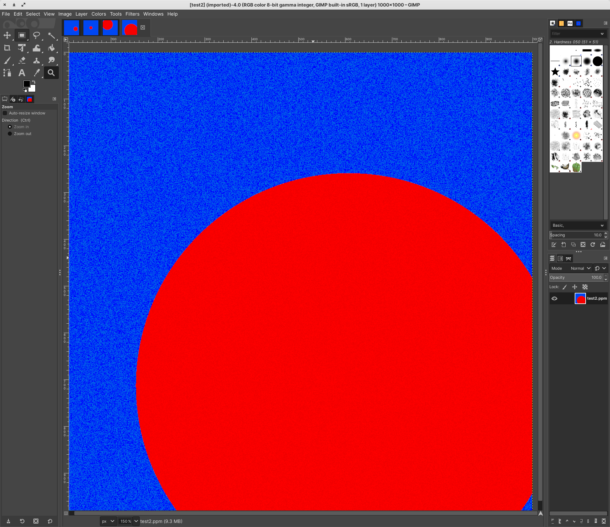
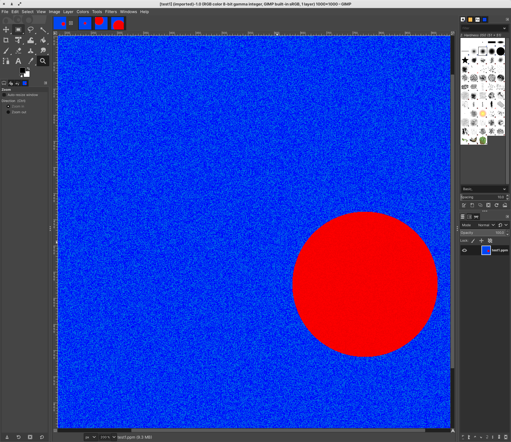
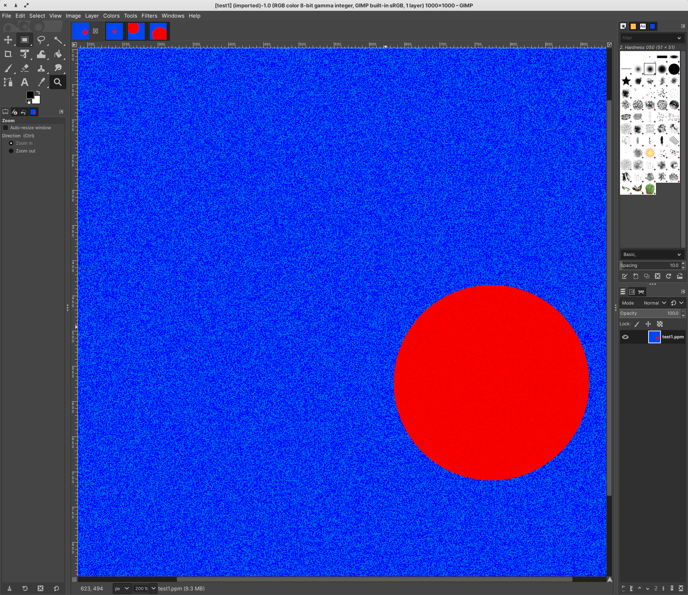

# LIN 313
 Projects and playing around for my Linguistics Language and Computers Class

 # Perceptron3000

 Working on making a simple perceptron for dealing with .ppm files. The goal is for the perceptron to be able to recognize circles in .ppm files.

 Got a random circle generator for .ppm files down though, check out

# Spellchecker

- Spell checker that is just a translation of Peter Norvig's 21 line Python spell-checker into Rust, I haven't done the full testing on it to compare against Python, but I think it works pretty well

# Bigram

- My attempt at making a language model, very naive and simple. It simply takes the bigrams of sentences, calculates their probabilities, and then generates text based of Markov chains.
