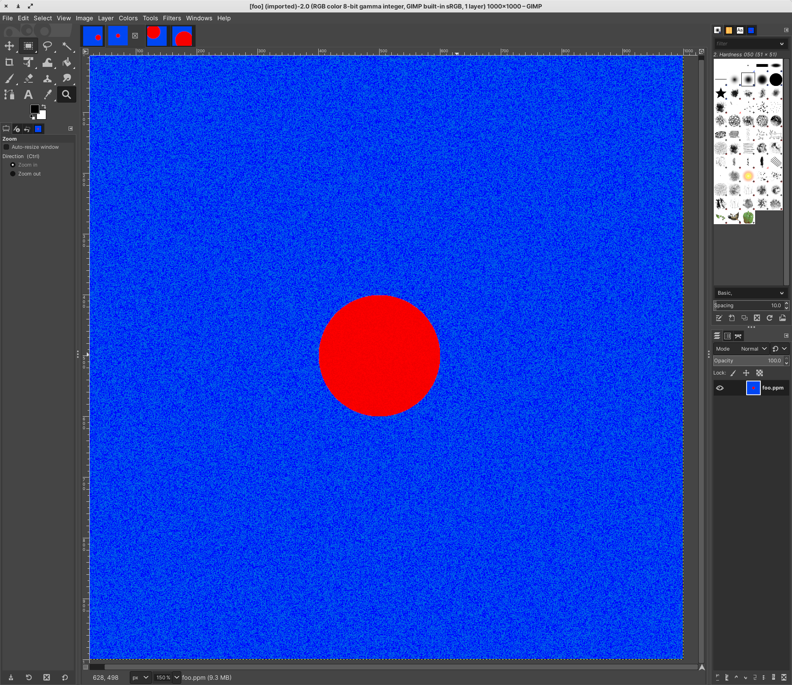

# LIN 313
 Projects and playing around for my Linguistics Language and Computers Class

 # Perceptron3000

 Working on making a simple perceptron for dealing with .ppm files. The goal is for the perceptron to be able to recognize circles in .ppm files.

 Got a random circle generator for .ppm files down though, check out

